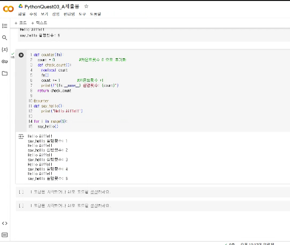
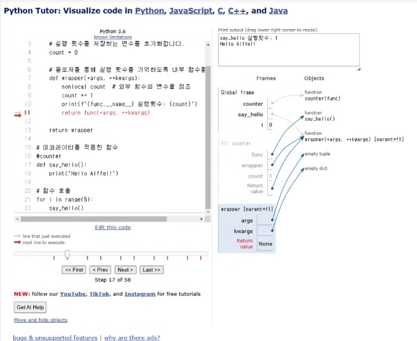
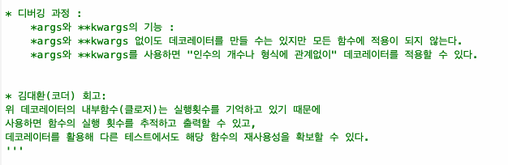

# AIFFEL Campus Online Code Peer Review Templete
- 코더 : 이국한
- 리뷰어 : 리뷰어의 이름을 작성하세요.


# PRT(Peer Review Template)
- [v]  **1. 주어진 문제를 해결하는 완성된 코드가 제출되었나요?**
    - 문제에서 요구하는 최종 결과물이 첨부되었는지 확인
        - 중요! 해당 조건을 만족하는 부분을 캡쳐해 근거로 첨부
        ******* 
    
- [v]  **2. 전체 코드에서 가장 핵심적이거나 가장 복잡하고 이해하기 어려운 부분에 작성된 
주석 또는 doc string을 보고 해당 코드가 잘 이해되었나요?**
    - 해당 코드 블럭을 왜 핵심적이라고 생각하는지 확인
    - 해당 코드 블럭에 doc string/annotation이 달려 있는지 확인
    - 해당 코드의 기능, 존재 이유, 작동 원리 등을 기술했는지 확인
    - 주석을 보고 코드 이해가 잘 되었는지 확인
        - 중요! 잘 작성되었다고 생각되는 부분을 캡쳐해 근거로 첨부
          *******핵심적인 부분은 update_min_max 함수 내부의 조건문으로,
          min_value와 max_value가 각각 갱신되는 로직입니다.
          min_value와 max_value 초기화와 클로저를 통한 보안성이 잘 설명되어 있어 이해가 용이합니다.
          코드의 동작 원리와 nonlocal 키워드의 역할도 명확히 기술되어 있습니다.***************
          ******** 
        
        
- [V]  **3. 에러가 난 부분을 디버깅하여 문제를 해결한 기록을 남겼거나
          ********새로운 시도 또는 추가 실험을 수행해봤나요?**
          초기화된 min_value와 max_value가 최솟값과 최댓값을 찾는 과정에서
          어떻게 영향을 주는지 기록한 디버깅 과정은 명확하게 설명되어 있습니다.
          코드에 오류는 없었으며, 특별한 추가 시도는 없지만, 초기화에 대한 설명이 잘 되어 있어
          디버깅 과정이 잘 나타나 있습니다.***************
        
- [v]  **4. 회고를 잘 작성했나요?**
    - 주어진 문제를 해결하는 완성된 코드 내지 프로젝트 결과물에 대해
    배운점과 아쉬운점, 느낀점 등이 기록되어 있는지 확인
    - 전체 코드 실행 플로우를 그래프로 그려서 이해를 돕고 있는지 확인
        - 중요! 잘 작성되었다고 생각되는 부분을 캡쳐해 근거로 첨부
        
- [ ]  **5. 코드가 간결하고 효율적인가요?**
          *******회고에서 클로저를 활용해 변수를 외부에 노출하지 않는 점의 중요성을 배운 점이 기록되어 있습니다.
       변수 보호를 통한 보안성 향상에 대해 이해하고 있음을 보여줍니다.
          - 중요! 잘 작성되었다고 생각되는 부분을 캡쳐해 근거로 첨부
          *******


# 회고(참고 링크 및 코드 개선)
```
코드가 간결하며 함수화를 통해 중복을 최소화했습니다. PEP8 스타일을 준수하며 클로저와 내부함수를 활용한 구성이 효율적입니다.
# 리뷰어의 회고를 작성합니다.
# 코드 리뷰 시 참고한 링크가 있다면 링크와 간략한 설명을 첨부합니다.
# 코드 리뷰를 통해 개선한 코드가 있다면 코드와 간략한 설명을 첨부합니다.
```
